  

  

# 👋 Olá, eu sou Hiago Laureano

### Full Stack Developer • Java • Spring Boot • React • Next.js

Transformando ideias em soluções digitais modernas, escaláveis e eficientes.

 

---

# 👨🏻‍💻 Sobre mim

🇧🇷 Brasil

Sou um desenvolvedor **Full Stack** apaixonado por tecnologia e resolução de problemas.

Tenho como objetivo desenvolver aplicações modernas utilizando boas práticas de desenvolvimento, arquitetura limpa e código escalável.

### Atualmente meu foco é:

- ☕ Java
- 🍃 Spring Boot
- ⚛️ React
- ▲ Next.js
- 🐘 PostgreSQL
- 🐳 Docker
- ☁️ AWS
- 🏗️ Clean Architecture
- 🔥 APIs REST

Sempre buscando aprender novas tecnologias e construir soluções que gerem impacto real.

---

# 🚀 Tech Stack

## Backend

  

## Frontend

  

## Banco de Dados

  

## DevOps & Ferramentas

---

# 📊 GitHub Analytics

  

---

# 🏆 GitHub Trophies

---

# 📈 Contribution Graph

---

# 🐍 Contribution Snake

---

# 🚀 Projetos em Destaque

| Projeto | Descrição | Tecnologias |
|---------|-----------|-------------|
| 💼 Sistema de Gestão | Plataforma completa para gerenciamento empresarial | Java • Spring Boot • PostgreSQL |
| 🌐 Portfólio | Site pessoal moderno e responsivo | React • Next.js • TypeScript |
| 🔗 API REST | API escalável utilizando boas práticas | Spring Boot • Docker • PostgreSQL |

---

# 🌱 Atualmente Estudando

---

# 📫 Vamos nos conectar

Estou sempre aberto para conversar sobre tecnologia, desenvolvimento de software, oportunidades e novos projetos.

 

---

# 💻 Ambiente de Desenvolvimento

---

# 💡 Frase que me inspira

> **"A melhor maneira de prever o futuro é construí-lo."**

---

### ⭐ Obrigado pela visita!

Se algum projeto chamou sua atenção, fique à vontade para entrar em contato.

 

